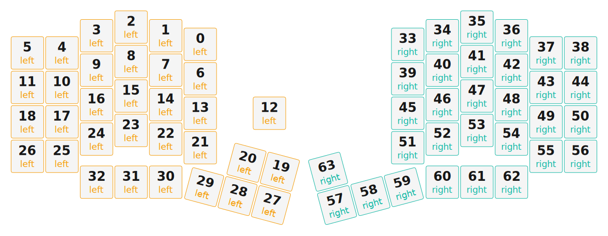

# ZMK Configuration for lizzard

*Generated by Shield Wizard for ZMK*



Download compiled firmware from the Actions tab. <https://zmk.dev/docs/user-setup#installing-the-firmware>

Edit your keymap <https://zmk.dev/docs/keymaps>.
User keymap is located at [`config/lizzard.keymap`](config/lizzard.keymap).

-----

<details>
<summary>
Shield Wizard Debug Information
</summary>

In case of broken configuration, here is the Shield Wizard internal data used to generate this configuration:

Commit: 1bc308cbed65fac144201644c2075be718bdbf1f

```json
{"name":"lizzard","shield":"lizzard","dongle":false,"modules":["petejohanson/cirque"],"layout":[{"id":"01KKPDF4KQZCS9C8FHBBZGY271","part":0,"row":0,"col":2,"w":1,"h":1,"x":5,"y":-0.25,"r":0,"rx":0,"ry":0},{"id":"01KKPDF4KQPEQMG0B4V9FC7S6S","part":0,"row":0,"col":3,"w":1,"h":1,"x":4,"y":-0.5,"r":0,"rx":0,"ry":0},{"id":"01KKPDF4KQKEZWPJT94WH7J093","part":0,"row":0,"col":4,"w":1,"h":1,"x":3,"y":-0.75,"r":0,"rx":0,"ry":0},{"id":"01KKPDF4KQ7FHP8MDFBH3S47TT","part":0,"row":0,"col":5,"w":1,"h":1,"x":2,"y":-0.5,"r":0,"rx":0,"ry":0},{"id":"01KKPDF4KQA630AKJ7BT848ZKJ","part":0,"row":0,"col":6,"w":1,"h":1,"x":1,"y":0,"r":0,"rx":0,"ry":0},{"id":"01KKPDF4KQ6R3HT6XGBW4PJJHD","part":0,"row":0,"col":7,"w":1,"h":1,"x":0,"y":0,"r":0,"rx":0,"ry":0},{"id":"01KKPDF4KQ792WA4WGXC48Y8VN","part":0,"row":1,"col":2,"w":1,"h":1,"x":5,"y":0.75,"r":0,"rx":0,"ry":0},{"id":"01KKPDF4KQW52ETGQZW5H60KBK","part":0,"row":1,"col":3,"w":1,"h":1,"x":4,"y":0.5,"r":0,"rx":0,"ry":0},{"id":"01KKPDF4KQJ7AF0B8QQR83Y7N7","part":0,"row":1,"col":4,"w":1,"h":1,"x":3,"y":0.25,"r":0,"rx":0,"ry":0},{"id":"01KKPDF4KQ6QC6ZBWC6S30XTFH","part":0,"row":1,"col":5,"w":1,"h":1,"x":2,"y":0.5,"r":0,"rx":0,"ry":0},{"id":"01KKPDF4KRENBFQZJKEWFCFG5A","part":0,"row":1,"col":6,"w":1,"h":1,"x":1,"y":1,"r":0,"rx":0,"ry":0},{"id":"01KKPDF4KR68VB3A94HV8G678F","part":0,"row":1,"col":7,"w":1,"h":1,"x":0,"y":1,"r":0,"rx":0,"ry":0},{"id":"01KKPDF4KRSYDXJH4KBV3NRZAD","part":0,"row":2,"col":0,"w":1,"h":1,"x":7,"y":1.75,"r":0,"rx":0,"ry":0},{"id":"01KKPDF4KREHA0PK47YVR2YATF","part":0,"row":2,"col":2,"w":1,"h":1,"x":5,"y":1.75,"r":0,"rx":0,"ry":0},{"id":"01KKPDF4KR3XYXFQRJXKE0J65Y","part":0,"row":2,"col":3,"w":1,"h":1,"x":4,"y":1.5,"r":0,"rx":0,"ry":0},{"id":"01KKPDF4KRZETKHHZZ5ZVRAFXK","part":0,"row":2,"col":4,"w":1,"h":1,"x":3,"y":1.25,"r":0,"rx":0,"ry":0},{"id":"01KKPDF4KRH0E0R6P3SZ3KGM4P","part":0,"row":2,"col":5,"w":1,"h":1,"x":2,"y":1.5,"r":0,"rx":0,"ry":0},{"id":"01KKPDF4KR0K1SDMS9QB21879C","part":0,"row":2,"col":6,"w":1,"h":1,"x":1,"y":2,"r":0,"rx":0,"ry":0},{"id":"01KKPDF4KRCJJPTAK496RMQ53Z","part":0,"row":2,"col":7,"w":1,"h":1,"x":0,"y":2,"r":0,"rx":0,"ry":0},{"id":"01KKPDF4KR6FP9JRDDBGWWYNHJ","part":0,"row":3,"col":0,"w":1,"h":1,"x":7,"y":2.75,"r":15,"rx":5,"ry":4.75},{"id":"01KKPDF4KRG0B5EAQKJ7ZTXRXJ","part":0,"row":3,"col":1,"w":1,"h":1,"x":6,"y":2.75,"r":15,"rx":5,"ry":4.75},{"id":"01KKPDF4KRQD1SBRZWS6ESAZN0","part":0,"row":3,"col":2,"w":1,"h":1,"x":5,"y":2.75,"r":0,"rx":0,"ry":0},{"id":"01KKPDF4KRST1GYE6HESNRVRHZ","part":0,"row":3,"col":3,"w":1,"h":1,"x":4,"y":2.5,"r":0,"rx":0,"ry":0},{"id":"01KKPDF4KRQKBWXJ37Y3BNPZEJ","part":0,"row":3,"col":4,"w":1,"h":1,"x":3,"y":2.25,"r":0,"rx":0,"ry":0},{"id":"01KKPDF4KR3S0HB1SA9CN4TTWN","part":0,"row":3,"col":5,"w":1,"h":1,"x":2,"y":2.5,"r":0,"rx":0,"ry":0},{"id":"01KKPDF4KR67VJ60XDNFJYXD0Z","part":0,"row":3,"col":6,"w":1,"h":1,"x":1,"y":3,"r":0,"rx":0,"ry":0},{"id":"01KKPDF4KR1BGR79X9N2Q8XGDQ","part":0,"row":3,"col":7,"w":1,"h":1,"x":0,"y":3,"r":0,"rx":0,"ry":0},{"id":"01KKPDF4KR5W01HZNZZCS0HPN5","part":0,"row":4,"col":0,"w":1,"h":1,"x":7,"y":3.75,"r":15,"rx":5,"ry":4.75},{"id":"01KKPDF4KR9BK4993MMCJPRMWS","part":0,"row":4,"col":1,"w":1,"h":1,"x":6,"y":3.75,"r":15,"rx":5,"ry":4.75},{"id":"01KKPDF4KRT0DJNJ5N4WPJBPBD","part":0,"row":4,"col":2,"w":1,"h":1,"x":5,"y":3.75,"r":15,"rx":5,"ry":4.75},{"id":"01KKPDF4KR86826XTB8A5Z43BJ","part":0,"row":4,"col":3,"w":1,"h":1,"x":4,"y":3.75,"r":0,"rx":0,"ry":0},{"id":"01KKPDF4KRRE8YGN4MHY7M5KRY","part":0,"row":4,"col":4,"w":1,"h":1,"x":3,"y":3.75,"r":0,"rx":0,"ry":0},{"id":"01KKPDF4KRG2H7BT01V93HCBDZ","part":0,"row":4,"col":5,"w":1,"h":1,"x":2,"y":3.75,"r":0,"rx":0,"ry":0},{"id":"01KKPDF4KQF5S7A7CH9D3E1AEM","part":1,"row":5,"col":10,"w":1,"h":1,"x":11,"y":-0.25,"r":0,"rx":0,"ry":0},{"id":"01KKPDF4KQ1PRTF18MCA70PZ0C","part":1,"row":5,"col":11,"w":1,"h":1,"x":12,"y":-0.5,"r":0,"rx":0,"ry":0},{"id":"01KKPDF4KQ4H8M1H3JCQRZSWJY","part":1,"row":5,"col":12,"w":1,"h":1,"x":13,"y":-0.75,"r":0,"rx":0,"ry":0},{"id":"01KKPDF4KQ6WXSV9QEGB9681X8","part":1,"row":5,"col":13,"w":1,"h":1,"x":14,"y":-0.5,"r":0,"rx":0,"ry":0},{"id":"01KKPDF4KQJ81TDBJSE2VWPFT3","part":1,"row":5,"col":14,"w":1,"h":1,"x":15,"y":0,"r":0,"rx":0,"ry":0},{"id":"01KKPDF4KQG9QHDZTTW20CRVDF","part":1,"row":5,"col":15,"w":1,"h":1,"x":16,"y":0,"r":0,"rx":0,"ry":0},{"id":"01KKPDF4KQY95H2J05Z4AAFNHX","part":1,"row":6,"col":10,"w":1,"h":1,"x":11,"y":0.75,"r":0,"rx":0,"ry":0},{"id":"01KKPDF4KQE0AJDDDGKD7QKBNB","part":1,"row":6,"col":11,"w":1,"h":1,"x":12,"y":0.5,"r":0,"rx":0,"ry":0},{"id":"01KKPDF4KQPGHHCWG3GJEX3H95","part":1,"row":6,"col":12,"w":1,"h":1,"x":13,"y":0.25,"r":0,"rx":0,"ry":0},{"id":"01KKPDF4KQ572XQ5RJAG3B0180","part":1,"row":6,"col":13,"w":1,"h":1,"x":14,"y":0.5,"r":0,"rx":0,"ry":0},{"id":"01KKPDF4KRZRG78B957GCYX6BQ","part":1,"row":6,"col":14,"w":1,"h":1,"x":15,"y":1,"r":0,"rx":0,"ry":0},{"id":"01KKPDF4KRFP9XB8GTKDPD6MVH","part":1,"row":6,"col":15,"w":1,"h":1,"x":16,"y":1,"r":0,"rx":0,"ry":0},{"id":"01KKPDF4KR5PHXZ0Q8TQD5CN0E","part":1,"row":7,"col":10,"w":1,"h":1,"x":11,"y":1.75,"r":0,"rx":0,"ry":0},{"id":"01KKPDF4KR0TE8ZSMNSV9K3EDR","part":1,"row":7,"col":11,"w":1,"h":1,"x":12,"y":1.5,"r":0,"rx":0,"ry":0},{"id":"01KKPDF4KRAA0XVT5Y4DSDW6ES","part":1,"row":7,"col":12,"w":1,"h":1,"x":13,"y":1.25,"r":0,"rx":0,"ry":0},{"id":"01KKPDF4KRR5V438NWV1HT8HPS","part":1,"row":7,"col":13,"w":1,"h":1,"x":14,"y":1.5,"r":0,"rx":0,"ry":0},{"id":"01KKPDF4KR15Y2F1F26G5RVGSH","part":1,"row":7,"col":14,"w":1,"h":1,"x":15,"y":2,"r":0,"rx":0,"ry":0},{"id":"01KKPDF4KRB1SRCR1AATSDA0BT","part":1,"row":7,"col":15,"w":1,"h":1,"x":16,"y":2,"r":0,"rx":0,"ry":0},{"id":"01KKPDF4KRPQ220VJPRC68RCSZ","part":1,"row":8,"col":10,"w":1,"h":1,"x":11,"y":2.75,"r":0,"rx":0,"ry":0},{"id":"01KKPDF4KRVMJNF3RKHZVA7RPR","part":1,"row":8,"col":11,"w":1,"h":1,"x":12,"y":2.5,"r":0,"rx":0,"ry":0},{"id":"01KKPDF4KREX3P4MKS9R4ECNKY","part":1,"row":8,"col":12,"w":1,"h":1,"x":13,"y":2.25,"r":0,"rx":0,"ry":0},{"id":"01KKPDF4KR9ZP247PD4AC1ASDQ","part":1,"row":8,"col":13,"w":1,"h":1,"x":14,"y":2.5,"r":0,"rx":0,"ry":0},{"id":"01KKPDF4KRQJ4SMKJSJWDGQBAM","part":1,"row":8,"col":14,"w":1,"h":1,"x":15,"y":3,"r":0,"rx":0,"ry":0},{"id":"01KKPDF4KRBYS8CY119TM2QWCF","part":1,"row":8,"col":15,"w":1,"h":1,"x":16,"y":3,"r":0,"rx":0,"ry":0},{"id":"01KKPDF4KRKC1WWH28VH6S41VA","part":1,"row":9,"col":8,"w":1,"h":1,"x":9,"y":3.75,"r":-15,"rx":12,"ry":4.75},{"id":"01KKPDF4KR98E51MNX4A0R62JA","part":1,"row":9,"col":9,"w":1,"h":1,"x":10,"y":3.75,"r":-15,"rx":12,"ry":4.75},{"id":"01KKPDF4KR8Y1PNY8B11RVZEZK","part":1,"row":9,"col":10,"w":1,"h":1,"x":11,"y":3.75,"r":-15,"rx":12,"ry":4.75},{"id":"01KKPDF4KRZZD4YB35HVB0KBWB","part":1,"row":9,"col":11,"w":1,"h":1,"x":12,"y":3.75,"r":0,"rx":0,"ry":0},{"id":"01KKPDF4KRZEGY0C0TFHF5CGCW","part":1,"row":9,"col":12,"w":1,"h":1,"x":13,"y":3.75,"r":0,"rx":0,"ry":0},{"id":"01KKPDF4KR9RPXM2N51HEKM5TG","part":1,"row":9,"col":13,"w":1,"h":1,"x":14,"y":3.75,"r":0,"rx":0,"ry":0},{"id":"01KKPDF4KRSCDDVABBYQM4DWT7","part":1,"row":10,"col":8,"w":1,"h":1,"x":9,"y":2.75,"r":-15,"rx":12,"ry":4.75}],"parts":[{"name":"left","controller":"nice_nano_v2","wiring":"matrix_diode","pins":{"d3":"input","d4":"input","d5":"input","d6":"input","d7":"input","d21":"output","d20":"output","d19":"output","d18":"output","d15":"output","d14":"output","d16":"output","d10":"output","d8":"encoder","d9":"encoder","d0":"bus","d2":"bus","d1":"bus"},"keys":{"01KKPDF4KQ6R3HT6XGBW4PJJHD":{"input":"d3","output":"d10"},"01KKPDF4KQA630AKJ7BT848ZKJ":{"input":"d3","output":"d16"},"01KKPDF4KQ7FHP8MDFBH3S47TT":{"input":"d3","output":"d14"},"01KKPDF4KQKEZWPJT94WH7J093":{"input":"d3","output":"d15"},"01KKPDF4KQPEQMG0B4V9FC7S6S":{"input":"d3","output":"d18"},"01KKPDF4KQZCS9C8FHBBZGY271":{"input":"d3","output":"d19"},"01KKPDF4KR68VB3A94HV8G678F":{"input":"d4","output":"d10"},"01KKPDF4KRENBFQZJKEWFCFG5A":{"input":"d4","output":"d16"},"01KKPDF4KQ6QC6ZBWC6S30XTFH":{"input":"d4","output":"d14"},"01KKPDF4KQJ7AF0B8QQR83Y7N7":{"input":"d4","output":"d15"},"01KKPDF4KQW52ETGQZW5H60KBK":{"input":"d4","output":"d18"},"01KKPDF4KQ792WA4WGXC48Y8VN":{"input":"d4","output":"d19"},"01KKPDF4KRCJJPTAK496RMQ53Z":{"input":"d5","output":"d10"},"01KKPDF4KR0K1SDMS9QB21879C":{"input":"d5","output":"d16"},"01KKPDF4KRZETKHHZZ5ZVRAFXK":{"input":"d5","output":"d15"},"01KKPDF4KR3XYXFQRJXKE0J65Y":{"input":"d5","output":"d18"},"01KKPDF4KRH0E0R6P3SZ3KGM4P":{"input":"d5","output":"d14"},"01KKPDF4KREHA0PK47YVR2YATF":{"input":"d5","output":"d19"},"01KKPDF4KRQD1SBRZWS6ESAZN0":{"input":"d6","output":"d19"},"01KKPDF4KRT0DJNJ5N4WPJBPBD":{"input":"d7","output":"d19"},"01KKPDF4KRSYDXJH4KBV3NRZAD":{"input":"d5","output":"d21"},"01KKPDF4KR6FP9JRDDBGWWYNHJ":{"input":"d6","output":"d21"},"01KKPDF4KR5W01HZNZZCS0HPN5":{"input":"d7","output":"d21"},"01KKPDF4KRG0B5EAQKJ7ZTXRXJ":{"input":"d6","output":"d20"},"01KKPDF4KR9BK4993MMCJPRMWS":{"input":"d7","output":"d20"},"01KKPDF4KRST1GYE6HESNRVRHZ":{"input":"d6","output":"d18"},"01KKPDF4KR86826XTB8A5Z43BJ":{"input":"d7","output":"d18"},"01KKPDF4KRQKBWXJ37Y3BNPZEJ":{"input":"d6","output":"d15"},"01KKPDF4KRRE8YGN4MHY7M5KRY":{"input":"d7","output":"d15"},"01KKPDF4KR3S0HB1SA9CN4TTWN":{"input":"d6","output":"d14"},"01KKPDF4KRG2H7BT01V93HCBDZ":{"input":"d7","output":"d14"},"01KKPDF4KR67VJ60XDNFJYXD0Z":{"input":"d6","output":"d16"},"01KKPDF4KR1BGR79X9N2Q8XGDQ":{"input":"d6","output":"d10"},"01KKPDF4KQG9QHDZTTW20CRVDF":{"input":"d3"},"01KKPDF4KQJ81TDBJSE2VWPFT3":{"input":"d3"},"01KKPDF4KQ6WXSV9QEGB9681X8":{"input":"d3"},"01KKPDF4KQ4H8M1H3JCQRZSWJY":{"input":"d3"},"01KKPDF4KQ1PRTF18MCA70PZ0C":{"input":"d3"},"01KKPDF4KQF5S7A7CH9D3E1AEM":{"input":"d3"}},"encoders":[{"pinA":"d8","pinB":"d9"}],"buses":[{"name":"spi0","devices":[{"type":"niceview","cs":"d1"}],"type":"spi","mosi":"d0","miso":"","sck":"d2"},{"name":"spi1","devices":[],"type":"spi"},{"name":"spi2","devices":[],"type":"spi"},{"name":"spi3","devices":[],"type":"spi"},{"name":"i2c0","devices":[],"type":"i2c"},{"name":"i2c1","devices":[],"type":"i2c"}]},{"name":"right","controller":"nice_nano_v2","wiring":"matrix_diode","pins":{"d3":"input","d4":"input","d5":"input","d6":"input","d7":"input","d21":"output","d19":"output","d20":"output","d18":"output","d15":"output","d14":"output","d16":"output","d10":"output","d1":"bus","d0":"bus","d2":"bus"},"keys":{"01KKPDF4KQG9QHDZTTW20CRVDF":{"input":"d3","output":"d10"},"01KKPDF4KQJ81TDBJSE2VWPFT3":{"input":"d3","output":"d16"},"01KKPDF4KQ6WXSV9QEGB9681X8":{"input":"d3","output":"d14"},"01KKPDF4KQ4H8M1H3JCQRZSWJY":{"input":"d3","output":"d15"},"01KKPDF4KQ1PRTF18MCA70PZ0C":{"input":"d3","output":"d18"},"01KKPDF4KQF5S7A7CH9D3E1AEM":{"input":"d3","output":"d19"},"01KKPDF4KRFP9XB8GTKDPD6MVH":{"input":"d4","output":"d10"},"01KKPDF4KRZRG78B957GCYX6BQ":{"input":"d4","output":"d16"},"01KKPDF4KQ572XQ5RJAG3B0180":{"input":"d4","output":"d14"},"01KKPDF4KQPGHHCWG3GJEX3H95":{"input":"d4","output":"d15"},"01KKPDF4KQE0AJDDDGKD7QKBNB":{"input":"d4","output":"d18"},"01KKPDF4KQY95H2J05Z4AAFNHX":{"input":"d4","output":"d19"},"01KKPDF4KRB1SRCR1AATSDA0BT":{"input":"d5","output":"d10"},"01KKPDF4KR15Y2F1F26G5RVGSH":{"input":"d5","output":"d16"},"01KKPDF4KRR5V438NWV1HT8HPS":{"input":"d5","output":"d14"},"01KKPDF4KRAA0XVT5Y4DSDW6ES":{"input":"d5","output":"d15"},"01KKPDF4KR0TE8ZSMNSV9K3EDR":{"input":"d5","output":"d18"},"01KKPDF4KR5PHXZ0Q8TQD5CN0E":{"input":"d5","output":"d19"},"01KKPDF4KRBYS8CY119TM2QWCF":{"input":"d6","output":"d10"},"01KKPDF4KRQJ4SMKJSJWDGQBAM":{"input":"d6","output":"d16"},"01KKPDF4KR9ZP247PD4AC1ASDQ":{"input":"d6","output":"d14"},"01KKPDF4KREX3P4MKS9R4ECNKY":{"input":"d6","output":"d15"},"01KKPDF4KRVMJNF3RKHZVA7RPR":{"input":"d6","output":"d18"},"01KKPDF4KRPQ220VJPRC68RCSZ":{"input":"d6","output":"d19"},"01KKPDF4KR9RPXM2N51HEKM5TG":{"input":"d7","output":"d14"},"01KKPDF4KRZEGY0C0TFHF5CGCW":{"input":"d7","output":"d15"},"01KKPDF4KRZZD4YB35HVB0KBWB":{"input":"d7","output":"d18"},"01KKPDF4KR8Y1PNY8B11RVZEZK":{"input":"d7","output":"d19"},"01KKPDF4KR98E51MNX4A0R62JA":{"input":"d7","output":"d20"},"01KKPDF4KRKC1WWH28VH6S41VA":{"input":"d7","output":"d21"},"01KKPDF4KRSCDDVABBYQM4DWT7":{"input":"d6","output":"d21"}},"encoders":[],"buses":[{"name":"spi0","devices":[],"type":"spi"},{"name":"spi1","devices":[],"type":"spi"},{"name":"spi2","devices":[],"type":"spi"},{"name":"spi3","devices":[],"type":"spi"},{"name":"i2c0","devices":[{"dr":"d1","rotate90":false,"invertx":false,"inverty":false,"sleep":true,"noSecondaryTap":true,"noTaps":true,"sensitivity":"2x","type":"pinnacle_i2c","add":42}],"type":"i2c","sda":"d0","scl":"d2"},{"name":"i2c1","devices":[],"type":"i2c"}]}]}
```

</details>
